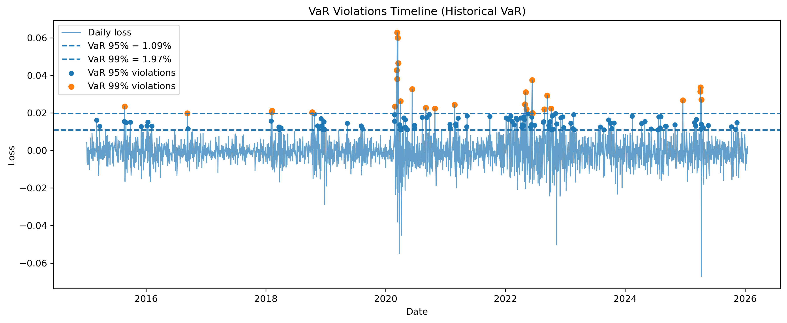

## Market Risk Case Study: Historical VaR, CVaR & Backtesting (ETF Portfolio)

## Objective
Estimate and validate **1-day market risk** for a diversified ETF portfolio using:

- **Historical Value at Risk (VaR)**
- **Conditional Value at Risk (CVaR / Expected Shortfall)**
- **Stress testing**
- **Formal VaR backtesting**

This project is designed as a **practical market-risk case study**, emphasizing transparent assumptions,
reproducible analysis, and industry-standard validation techniques.

---

## Business Questions
1. What is the portfolio’s **1-day 95% and 99% VaR**?
2. How severe are losses **beyond VaR** (CVaR)?
3. How does the portfolio behave under **extreme historical stress events**?
4. Is the VaR model **statistically reliable** when backtested?

---

## Portfolio
Multi-asset ETF portfolio with fixed weights:

| Ticker | Asset Class | Weight |
|------:|-------------|-------:|
| SPY | US Equities (S&P 500) | 0.20 |
| QQQ | US Growth Equities | 0.20 |
| IWM | US Small Caps | 0.15 |
| TLT | US Treasuries | 0.20 |
| GLD | Gold | 0.15 |
| HYG | High-Yield Credit | 0.10 |

---

## Data
- **Source:** Stooq
- **Frequency:** Daily
- **Period:** 2015-01-01 → most recent available date
- **Price field:** Close (stored as `adj_close`)

Saved dataset:
- `data/prices.csv` with columns: `date`, `ticker`, `adj_close`

---

## Methodology
1. Compute **daily arithmetic returns** for each ETF.
2. Construct portfolio daily return:

   `R_p,t = Σ_i w_i · R_i,t`

3. Convert returns to **losses**:

   `L_t = − R_p,t`

4. Estimate historical risk measures:
   - **VaR (α):** α-quantile of the loss distribution
   - **CVaR (α):** average loss conditional on losses exceeding VaR

Confidence levels:
- **95%**
- **99%**

---

## Historical Risk Results
Estimated from the full historical loss distribution:

- **95% VaR:** ~ **1.09%**
- **95% CVaR:** ~ **1.75%**
- **99% VaR:** ~ **1.97%**
- **99% CVaR:** ~ **2.98%**

**Interpretation:**
- VaR represents a **loss threshold**, not a worst-case outcome.
- CVaR is materially larger than VaR, indicating **meaningful tail risk**.
- Extreme historical losses exceed VaR, highlighting the limitations of threshold-based risk measures.

---

## Stress Testing
Stress tests complement VaR by examining portfolio behavior under **extreme but plausible scenarios**.

### Stress Test A — Worst Historical Single-Day Shocks
- Identification of the worst historical daily portfolio losses.
- Decomposition of losses by asset contribution.
- Worst single-day loss observed: **~6.28%** (March 2020).

### Stress Test B — COVID Crisis (Multi-Day Systemic Stress)
- Window: **February–April 2020**
- Cumulative portfolio return: **−12.33%**
- Maximum drawdown: **−20.26%**
- Worst single-day loss during window: **6.28%**

This scenario highlights the importance of **path dependency**, where losses persist beyond the initial shock.

### Stress Test C — Tariff Shock (April 2025 Policy Event)
- Window: **2025-04-02 → 2025-04-10**
- Cumulative portfolio return: **−4.75%**
- Maximum drawdown: **−8.76%**
- Worst daily loss: **3.36%**

This represents a **policy-driven stress regime**, materially less severe than systemic crises.

---

## Stress Test Comparison

| Scenario | Worst Daily Loss | Cumulative Return | Maximum Drawdown |
|--------|----------------:|------------------:|-----------------:|
| Historical worst (single day) | 6.28% | −6.28% | 6.28% |
| COVID crisis window | 6.28% | −12.33% | −20.26% |
| Tariff shock (Apr 2025) | 3.36% | −4.75% | −8.76% |

**Key insight:**  
VaR captures **single-day tail risk**, while stress testing reveals **loss persistence and drawdown risk**.

---

## VaR Backtesting
The Historical VaR model is evaluated using **out-of-sample backtesting**.

### Violation Rates

| VaR Level | Observations | Violations | Violation Rate | Expected Rate |
|---------|-------------:|-----------:|---------------:|--------------:|
| 95% | 2776 | 140 | 5.04% | 5.00% |
| 99% | 2776 | 28 | 1.01% | 1.00% |

### Kupiec Proportion of Failures Test

| VaR Level | LR Statistic | p-value |
|---------|-------------:|--------:|
| 95% | 0.0109 | 0.9169 |
| 99% | 0.0021 | 0.9635 |

**Interpretation:**
- Violation frequencies are statistically consistent with model assumptions.
- High p-values indicate **no rejection** of correct VaR coverage.
- The Historical VaR model is **well-calibrated** at both confidence levels.

### VaR Violation Timeline (Visual Sanity Check)

The figure below shows daily portfolio losses together with the 95% and 99% Historical VaR thresholds.
Violations are rare and concentrated during known stress periods, supporting model robustness.



---
## Requirements

This project was developed using **Python 3** and the following libraries:

- **pandas** — data manipulation and time-series analysis  
- **numpy** — numerical computations  
- **matplotlib** — data visualization  
- **scipy** — statistical tests (Kupiec test)

All analysis was performed using **Jupyter Notebooks**.

## Project Structure
```text
market-risk-var-cvar/
│
├── data/
│   └── prices.csv
│                  # Daily ETF prices
├── figures/
│   └── var_violation_timeline.png   # VaR backtesting visualization
│
├── notebook/
│   ├── market_risk_var_cvar.ipynb   # VaR & CVaR estimation
│   ├── stress_testing.ipynb         # Historical, COVID & tariff stress tests
│   └── var_backtesting.ipynb        # VaR violations & Kupiec test
│
│
├── README.md                        # Project documentation


